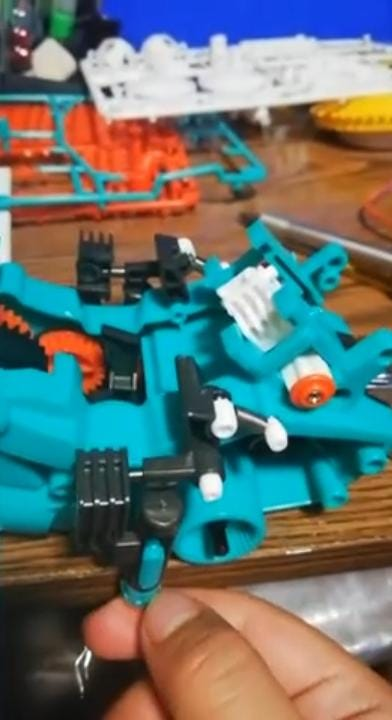
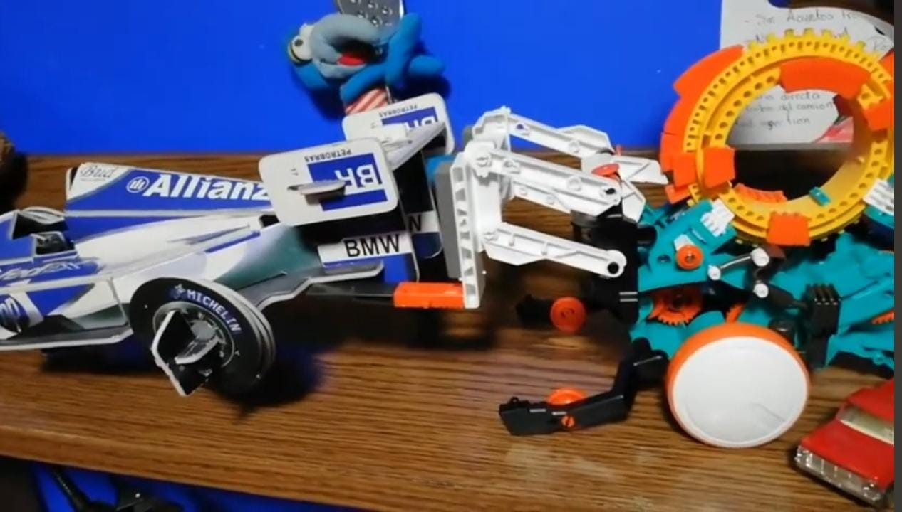

# kit-mec-nico-STEM

## Proyecto mecatrónico
Proyecto mecatrónico realizado con el kit STEM de Steren, donde se arman mecanismos como un robot dibujante, lanzapelota y montacarga. Se exploran principios básicos de mecánica y lógica de programación a través de una rueda codificadora.
## Integrantes

- Montserrat Buenrostro Hernández  
- Citlali Serrano  
- Johana Denisse Hernández  

## Imagen del proyecto

## Diagrama del circuito

## Pseudocódigo
Inicio  
Esperar que el botón sea presionado  
Mientras no termine el dibujo  
→ Mover Servo X  
→ Mover Servo Y  
→ Esperar  
→ Cambiar posición  
Fin  
Fin

## Subsistemas
| Subsistema        | Función                        | Componentes            |
|-------------------|-------------------------------|------------------------|
| Control           | Ejecuta instrucciones          | Microcontrolador       |
| Entrada           | Recibe señal del usuario       | Botón                  |
| Actuador          | Mueve el lápiz                 | Servo X, Servo Y       |
| Energía           | Alimenta todo                  | Fuente 5V              |

## Componentes
- Microcontrolador (Arduino o tarjeta del kit)
- 2 servomotores
- 1 botón
- 1 resistencia de 10k ohm
- Cables
- Fuente de alimentación

## Funcionamiento
1. El usuario presiona el botón.
2. El robot empieza a mover el lápiz.
3. Los servos crean un patrón de dibujo.
4. Se detienen al terminar la rutina.

## Recursos

- [Manual del kit de Steren](https://descargas.steren.com.mx/K-730-V0.0-instr.pdf)  
- [Página del producto en Steren](https://www.steren.com.mx/kit-para-armar-smartbot.html)

  ## Elaboración del Proyecto

### Paso 1: Preparación de materiales  
Antes de comenzar a armar los mecanismos, revisamos que todos los componentes estuvieran presentes en el kit y que el manual estuviera disponible para guiar la construcción.

Los componentes incluidos fueron:
- Rueda codificadora
- Motor y engranajes
- Placa base y piezas de montaje
- Sensores y cables de conexión
  
*Proceso de construcción*  

### Paso 2: Armado de los modelos  
Armamos los diferentes modelos según las instrucciones del kit:

- *Robot Dibujante*: Armamos el robot y configuramos la secuencia de movimiento usando la rueda codificadora.
- *Montacarga*: Se utilizó el motor para levantar objetos ligeros, siguiendo la misma lógica de programación mecánica.

Cada modelo fue probado y ajustado para asegurar que todos los movimientos funcionaran correctamente.

*Armado del robot*  

*Robot dibujante armado*  

### Paso 3: Programación y prueba  
La programación de los movimientos del robot fue realizada a través de la rueda codificadora, donde se configuran los movimientos básicos como avanzar, retroceder, girar a la derecha, y detenerse. Estos movimientos fueron probados en cada modelo, y ajustamos la secuencia de movimientos según fuera necesario.

### Paso 4: Reflexión  
Este proyecto nos permitió entender mejor cómo los principios mecánicos y de programación se interrelacionan para crear soluciones prácticas. También mejoramos nuestras habilidades en trabajo en equipo y resolución de problemas.

## Conclusiones

- Aprendimos a integrar *conceptos de mecánica* con *lógica de programación* en un solo proyecto.
- La *rueda codificadora* es una forma interesante de programar mecanismos de manera sencilla sin necesidad de código digital.
- Mejoramos nuestras habilidades de *trabajo en equipo*, ya que cada miembro contribuyó en diferentes etapas del armado y la programación del proyecto.
- Este proyecto es una excelente introducción a los conceptos de *ingeniería* y *tecnología, ya que nos permitió experimentar de manera práctica con los principios básicos de la **mecánica* y la *automatización*.

  
